CheckBox
============================

Implementation of receipt registration through CheckBox services

This module is developed by the `KitWorks <https://kitworks.systems/>`__.

1. Реєстрація організації на сайті "Checkbox".
============================

Необхідно зареєструвати організації на сайті Checkbox за допомогою електронно-цифрового підпису.
Реєструвати потрібно стільки організацій, скільки груп товарів потрібно будете створювати.
У тестовому прикладі їх дві, для алкоголю і продуктів окремо. Після реєстрації Ви отримаєте на кожну
організацію окремий файл з логінами, паролями і ключами до віртуального касового апарату.

2. Запуск застосунку “Checkbox Подпись”.
============================

2.1. Ввести дані з файлу в налаштування програми. Зверніть увагу на правильність введеної
посилання і обов'язково поставте галочку біля тестового сервера, якщо користуєтесь саме ним.

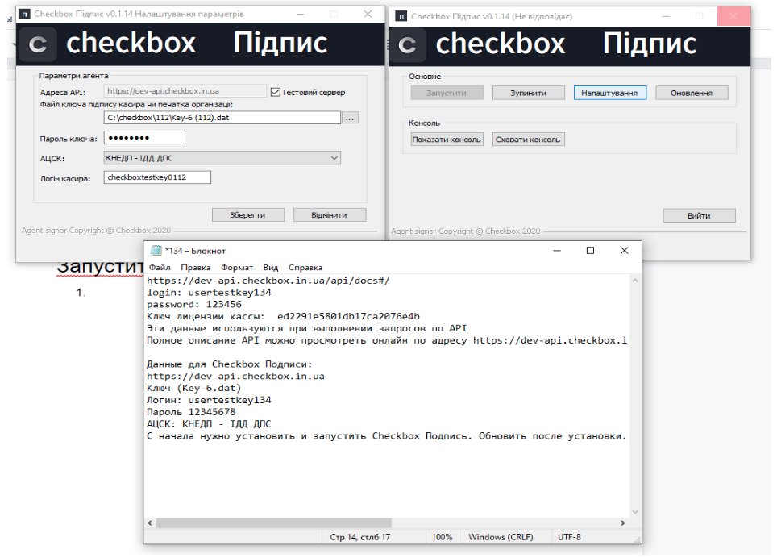

2.2. Залишити додаток працювати в фоновому режимі, поки ви користуєтесь віртуальною касою.

3. Створення користувачів.
============================

3.1. Адміністратор
Може бачити всі документи, операції, торгові точки, змінювати налаштування, створювати та видаляти всі сутності.
По замовчуванню логін: odoo, пароль: потрібно встановити через “Налаштування” - “Користувачі”.

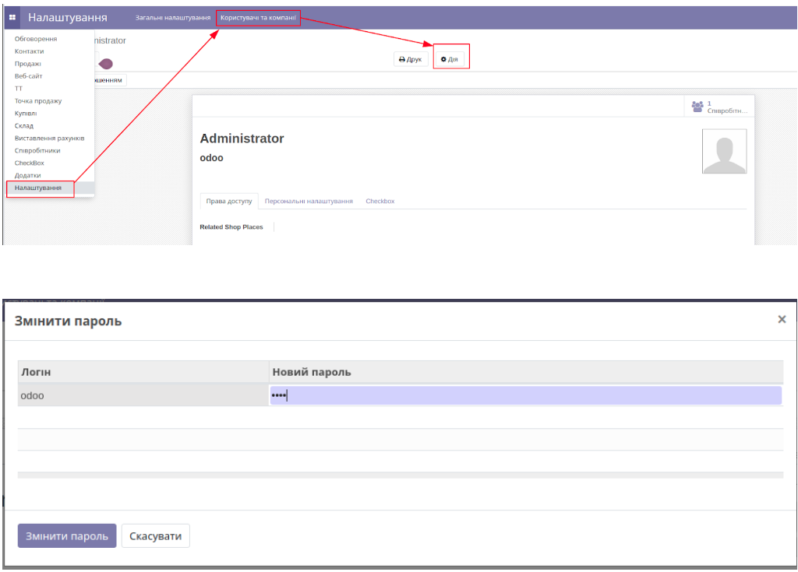

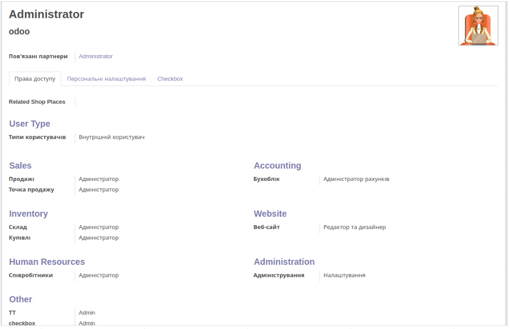

У всіх параметрах відмітити, що він “адміністратор”.

3.2. Менеджер.
Може бачити тільки свої (ті, що відносяться до торгових точок, в яких він є менеджером) документи,
операції, торгові точки. Не може змінювати налаштування, створювати та видаляти всі сутності в програмі.

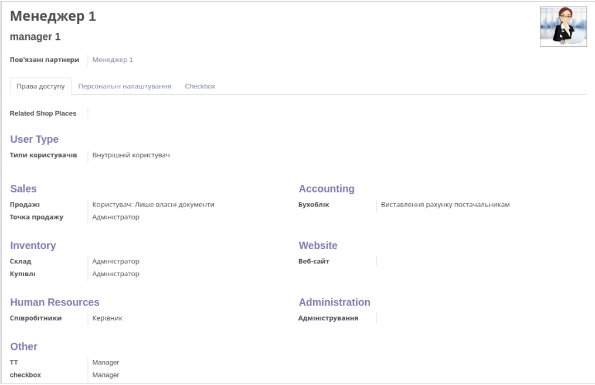

3.3. Продавець.
Може бачити тільки свій магазин, відкривати та закривати сесію. Здійснювати продажі. Прав на редагування,
додавання та видалення не має.

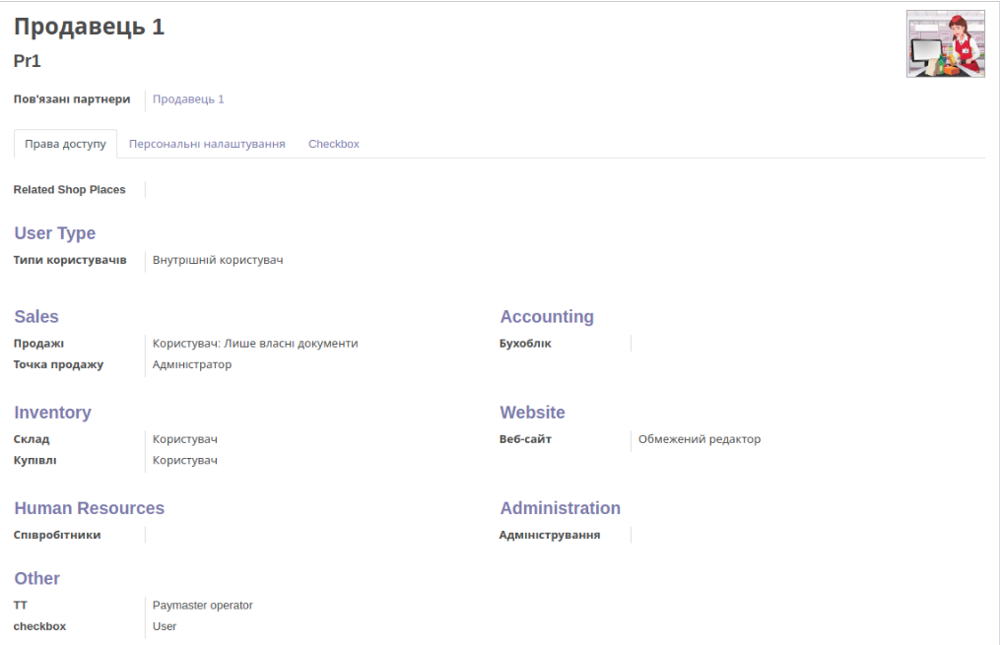

4. Створення касира.
============================

4.1. Перейти: “СheckBox” - “Налаштування” (Settings) - “Касир” (Cashier).

4.2. Клікнути "Створити".

4.3. Заповнити поля Username і Password даними з файлу - ключа віртуальної каси..

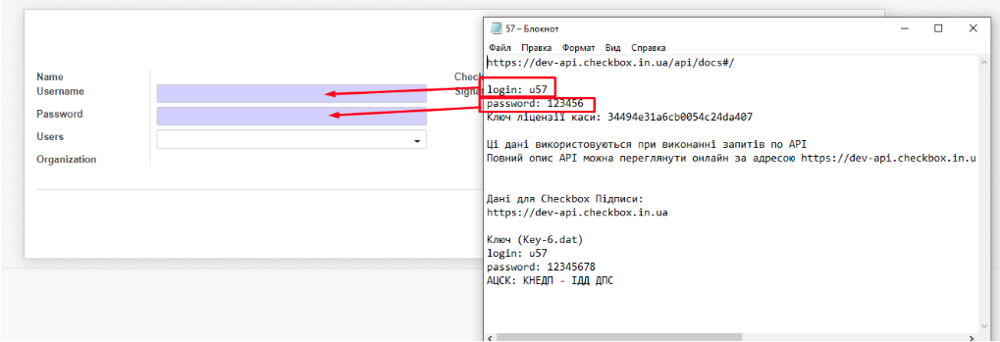

4.4. Вибрати користувачів, які зможуть користуватися цим віртуальним касиром.

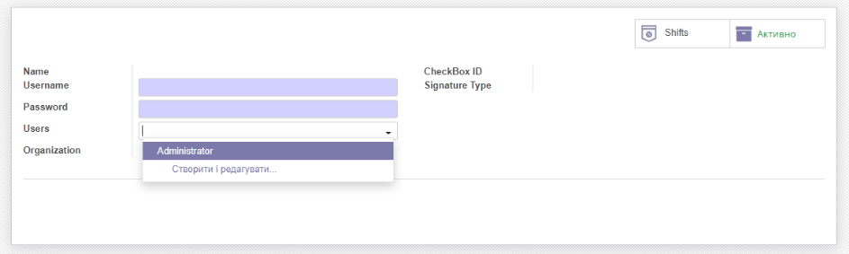

4.5. Клікнути "Зберегти".

4.6. Клікнути "Update info".

4.7. Після цього в картку касира підтягуються всі інші необхідні дані. Включаючи організацію, на яку
зареєстрований чекбокс.

5. Створення касового апарату.
============================

5.1. Перейти “СheckBox” - “Налаштування” (Settings) - “Касовий апарат” (Cash registers).

5.2. Клікнути "Створити".

5.3. Вибирати організацію, яка підтягнулася в картку чекбокса, після завершення його реєстрації в пункті 4.

5.4. Ввести ключ ліцензії.

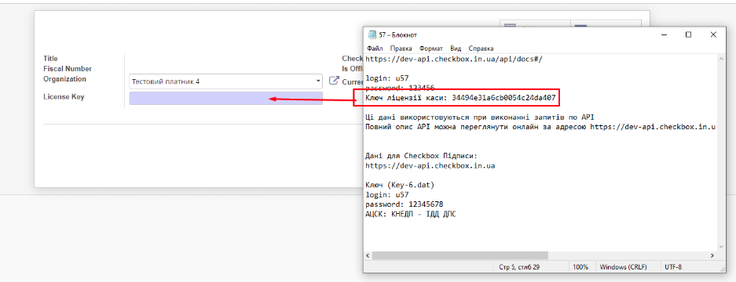

5.5. Виставити мін та макс кількість кодів для фіскалізації. Ці коди використовуються для фіскалізації операцій,
в момент, коли електронна каса з якихось причин є офлайн чи недоступна. При появі доступу до електронної каси
по цин кодам всї операції будуть фіскалізовані та отримають QR-коди. Кількусть необхідних кодів визначається
кількістю операцій за одиницю часу і виставляється менеджеров вручну. Програма замовить коди, коли їх кількість
стане менше вказаної і замовить стільки, щоб кількість дорівнювала максимальній вказаній.

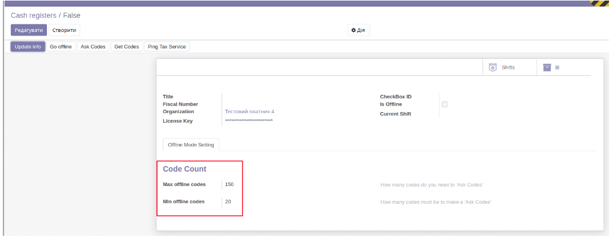

5.6. Клікнути "Зберегти".

5.7. Клікнути "Update info".

5.8. Після цього в картку касового апарату підтягуються всі необхідні дані.

6. Створення категорій фіскалізації товарів в CheckBox (Product Category).
============================

6.1. Перейти: “СheckBox” - “Налаштування” (Settings) - “Касовий апарат” (Cash registers).

6.2. Клікнути "Створити".
Це категорії товарів по яким буде диференціюватися фіскалізація операцій. В тестовому прикладі: “Акцизні” та ”Звичайні”.

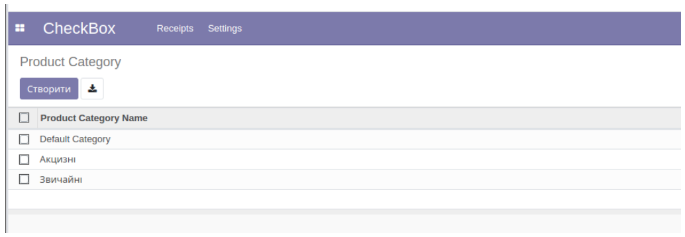

7. Створення товарів.
============================

7.1. Перейти: "Точка продаж" - "Товар" - "Товари".

7.2. Клікнути "створити".

7.3. Заповнити вкладки як показано на скріншотах

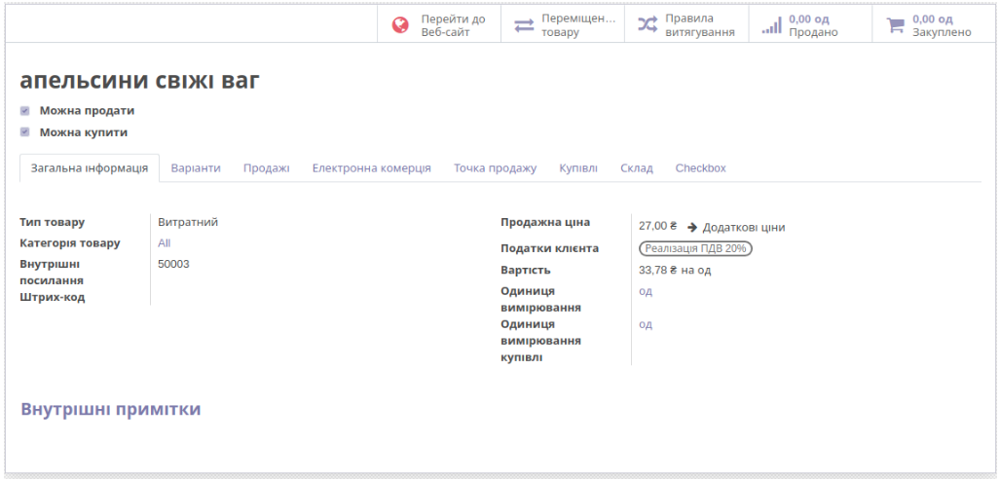

7.4. Вибрати категорію товару.
Її попередньо можна створити в “Категоріях товарів точки продажу”.
Зазвичай це розділення на продукти, промтовари, тютюн, алкоголь та інше.

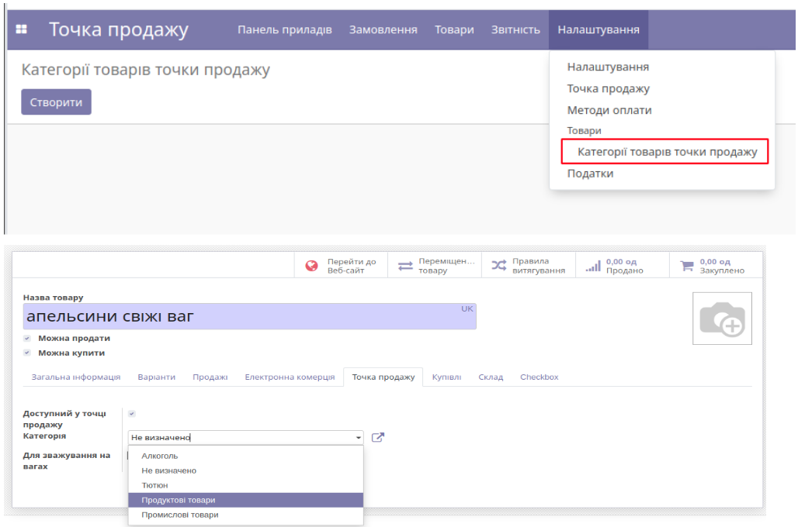

7.5. У вкладці Checkbox вибрати категорію фіскалізації.

7.6. Клікнути “Зберегти”.

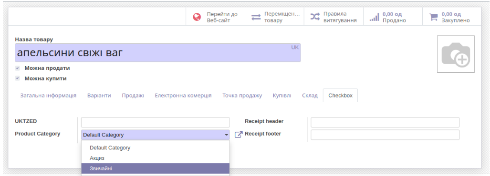

8. Створення компанії.
============================

8.1. Перейти “Налаштування” - “Користувачі та компанії” - “Компанії”

8.2. Створити генеральну компанію (або змінити MyCompany). Заповнюємо всі необхідні дані.

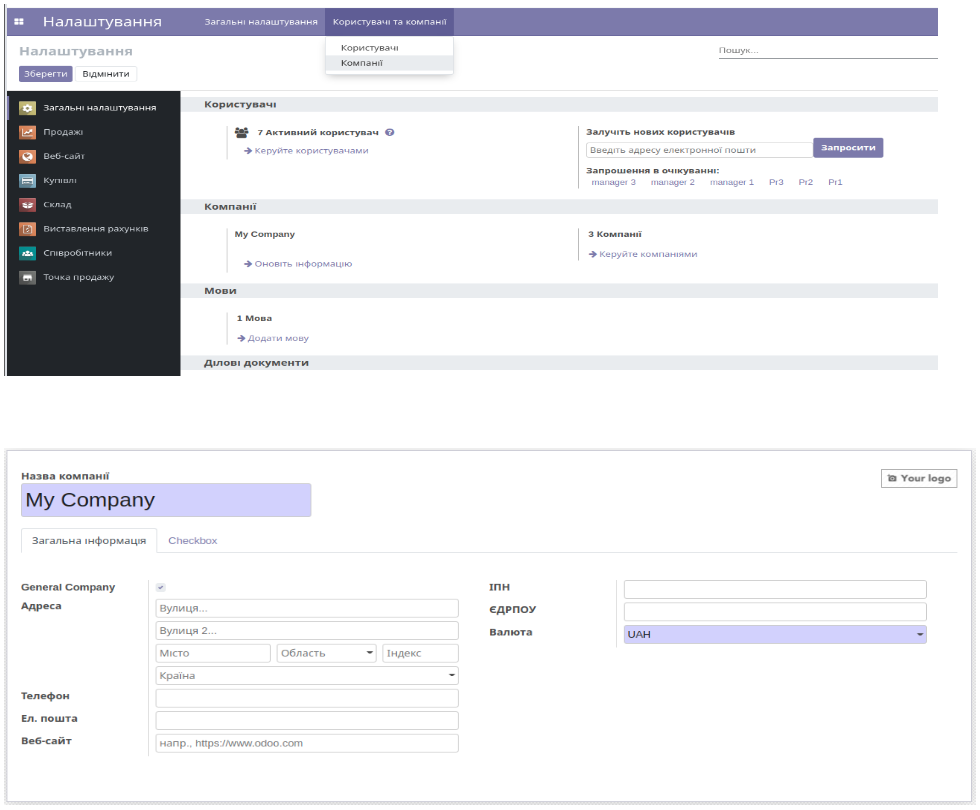

8.3. Потім створюємо дочірні компанії, вказуючи, товари якої категорії фіскалізації вона буде продавати.

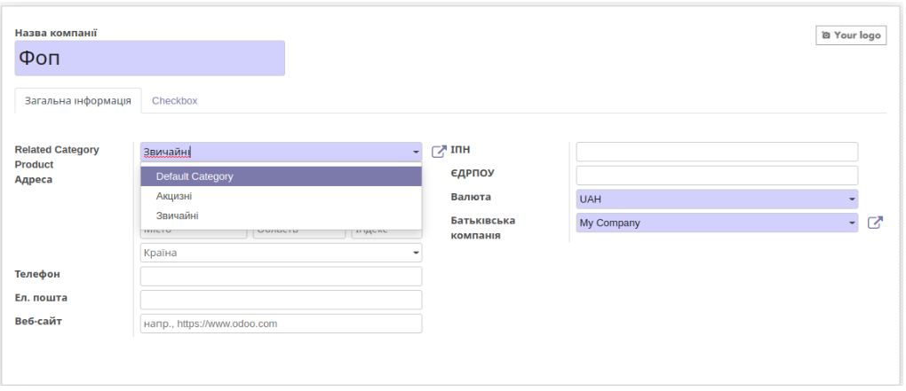

9. Додавання юзерам компаній.
============================
Всім існуючим та новим юзерам потрібно додати дозволені компанії.

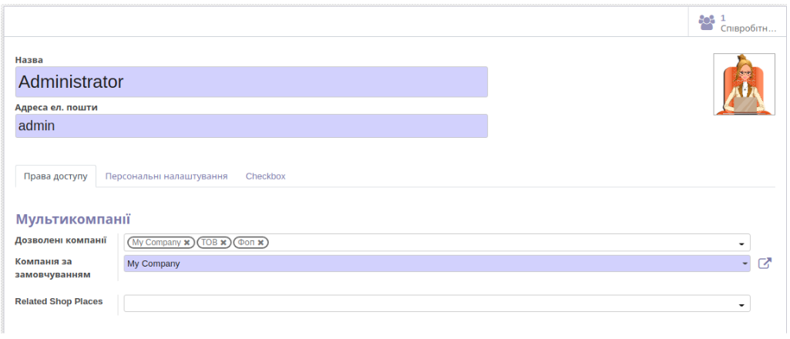

10. Створення журналів та рахунків для кожної компанії.
============================

10.1. Залогінитись адміном.

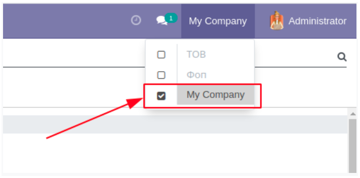

10.2. Включаючи по черзі кожну компанію окремо, перейти: “Налаштування” - “Виставлення рахунків” та вибрати в
“Фіскальній локалізації” “Упаковка” - “План рахунків ПСБО”.

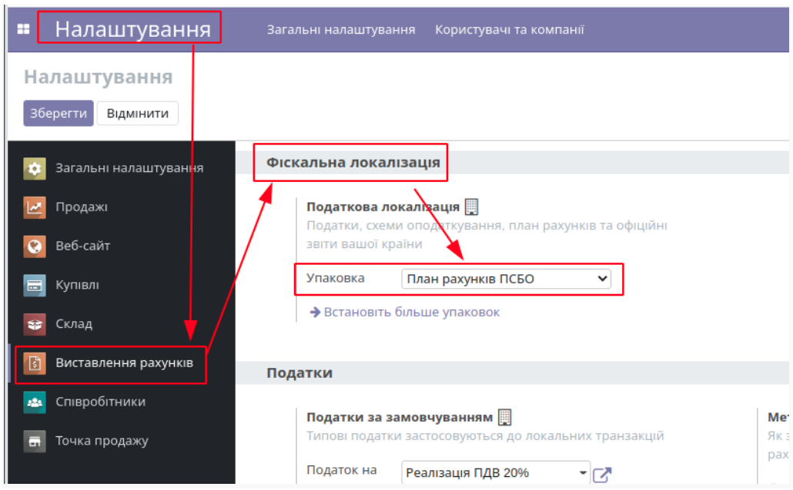

10.3. Натиснути “Зберегти”.

10.4. Повторити для решти компаній.
Звернути увагу на те, що після виконання операцій з компаніями, General Company повинна відображатись в правому
верхньому куті.

11. Створення методів оплати.
============================

11.1. Перейти “ТТ” - “Point of Sale” - “Payment method”. Нажати “Створити”

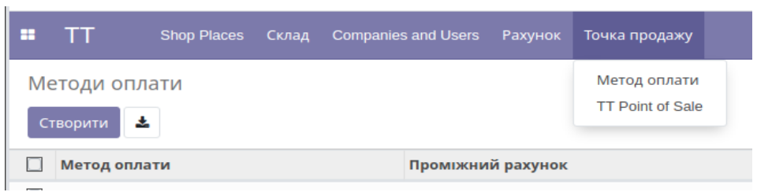

11.2. Заповнити всі поля відповідно методу, що створюється. В тестовому випадку метод “Акциз готівка”
створюється для компанії “ТОВ”, яка буде продавати підакцизні товари.

11.3. Для готівкових методів потрібно поставити галочку у відповідному чекбоксі “Готівка”.

11.4. Вибрати рахунки, які належать саме цій компанії.

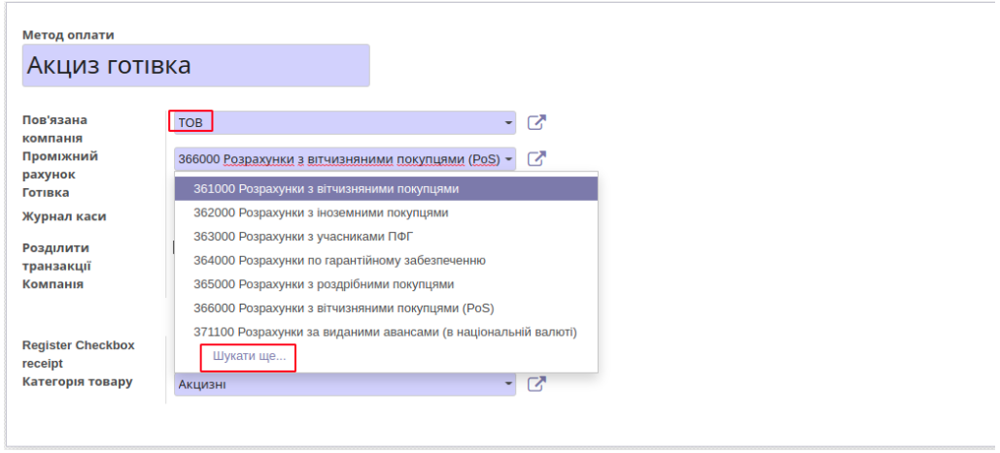

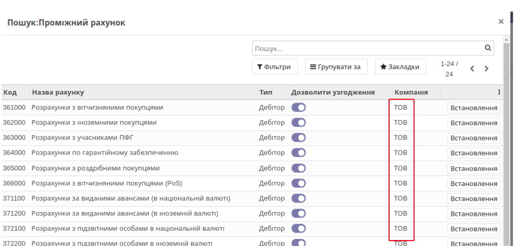

11.5. Аналогічно створюємо метод “Акциз банк”, “Акциз готівка не фіскальний” та “Акциз банк не фіскальний”.

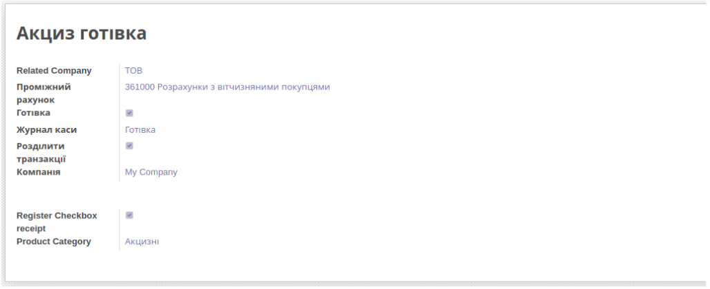

11.6. Далі по аналогії створюємо для компанії “ФОП”, яка буде продавати безакцизні товари.

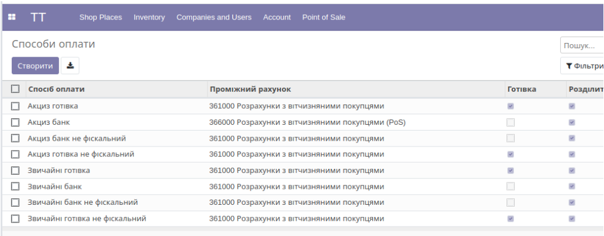

12. Створити TT Shop Places (Магазин).
============================

12.1. Перейти “ТТ” - “Shop Places” - “Створити”.

12.2. Додати компанії, які будуть продавати в цьому магазині.

12.3. Та юзерів, які будуть продавати в цьому магазині.
Інші дані створяться і підтягнуться автоматично. За виключенням налаштувань POS, які ми зробимо в наступних кроках.

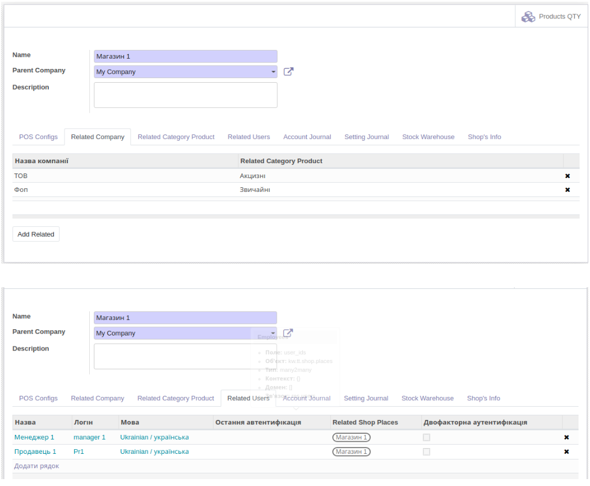

13. Створити точку продажу POS.
============================

13.1. Зайти в "Точка продажу" - "Налаштування" - "Точка продажу".

13.2. Клікнути "Створити".

13.3. Ввести назву торгової точки, та вибрати магазин, для якого вона створюється.

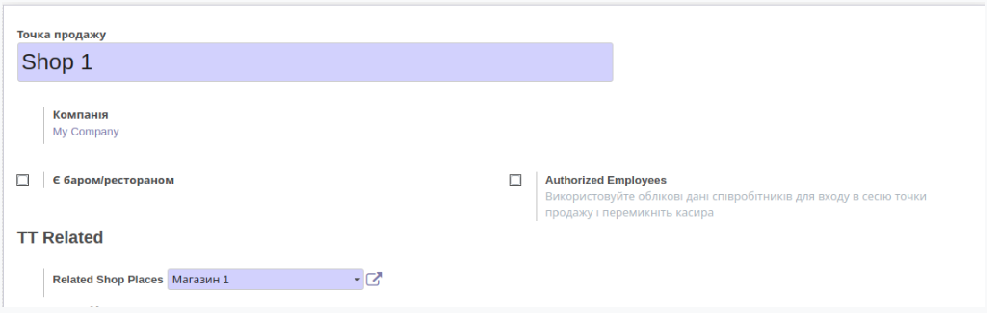

13.4. Вибрати категорії CheckBox.

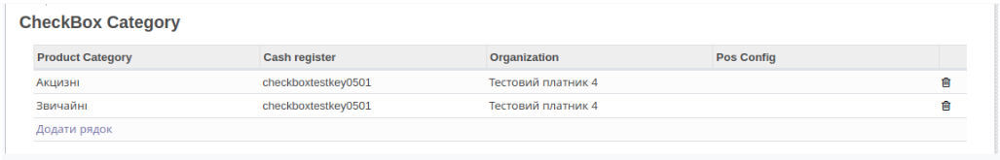

13.5. Вибрати методи оплати.

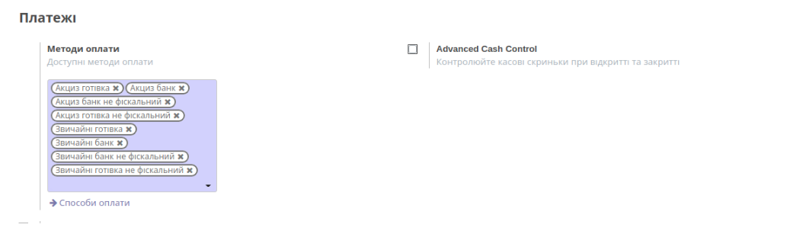

13.6. Клікнути "Зберегти".

14. Заповнити поле “Місце призначення” в переміщеннях.
============================

14.1. Перейти “Склад” - “Типи операцій”.

14.2. Вибрати “Замовлення на доставку”.

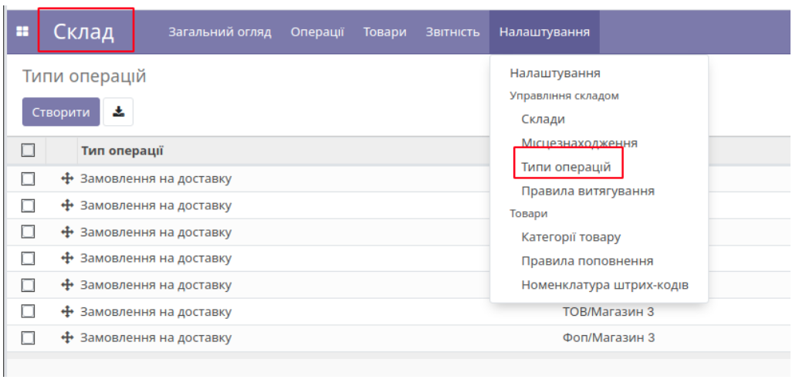

14.3. В кожному з обраних типів операції (окрім генеральної компанії) обрати склад місця призначення за замовчуванням.
Пересвідчитись, що обрано саме склад (це відображається в назві).

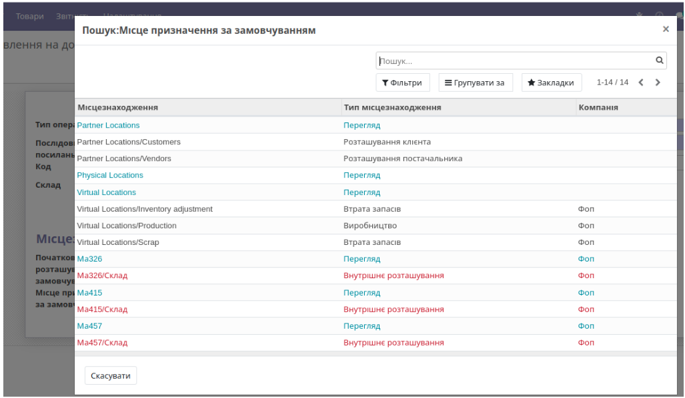

15. Відкриття сесії.
============================

15.1. Залогінитися користувачем.

15.2. Зайти в "Точки продаж". Точка продажу по замовчуванню є в татусі “Online”. Користувачу з правами доступу “User”
буде доступна тільки та точка продажу, продавцем якої він є.

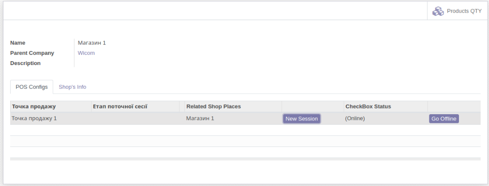

15.3. На вибраній точці продажу клікнути "Нова сесія".

16. Продаж товарів.
============================

16.1. В один чек можна додавати товари тільки однієї і тієї ж категорії чекбокса (акциз або звичайний товар).

16.2. При спробі застосування до товару однієї категорії методу оплати другої категорії. отримаєте помилку.
Приклад: шоколад можна оплатити методом "Прод нал" або "Прод банк" і не можна оплатити методом "Алк нал" або "Алк банк".

17. Робота в офлайн режимі.
============================

При відкритті нової сесії проходить перевірка наявності офлайн кодів та їх кількості.
Якщо їх кількість менша за встановлену, програма автоматично замовить стільки, що би вона сягала
виставлених максимальних значень. Ці показники редагуються в кожній віртуальній касі.
У випадку, якщо з якихось причин віртуальна каса CheckBox не працює і знаходиться в режимі “офлайн”
(перервалось з’єднання, вимкнули світло) то в нас автоматично в операції додаються офлайн коди CheckBox.
І при виході віртуальної касі в “онлайн” по цим кодам буде проведена фіскалізація операцій і отримання QR кодів.

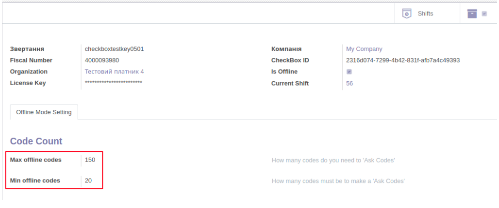

18. Не фіскальні операції.
============================

При створенні методів оплати можна створити не фіскальні методи, тобто не додавати до них опцію
фіскалізації через прив’язку до віртуальної каси галочкою CheckBox.
Ці операції записуються в окремий журнал, не фіскалізуються, не отримують QR кодів.

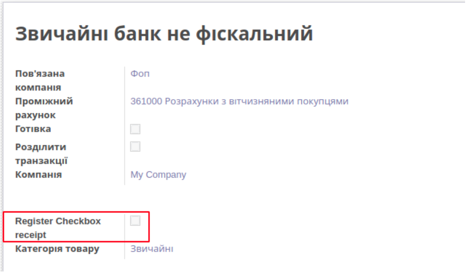

19. Додавання податків.
============================

19.1. Створити податки в аккаунті CheckBox.

19.2. Перейти: CheckBox - Налаштування - Cash registers.

19.3. В кожному реєстраторі натиснути кнопку “Get All Tax”.

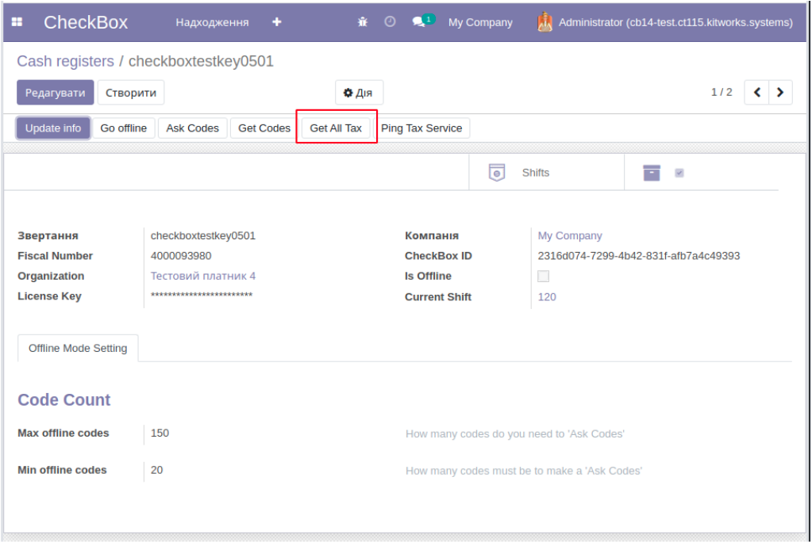

19.4. Перейти: Меню - CheckBox - Налаштування - Тах
Там з’явиться список всіх податків, що підтягнулися з аккауну CheckBox.

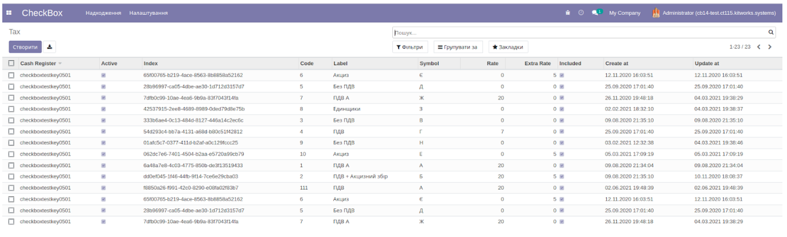

19.5. Перейти: Меню - Виставлення рахунків - Налаштування - Податки
Тут є список всіх податків, які створені в Odoo.

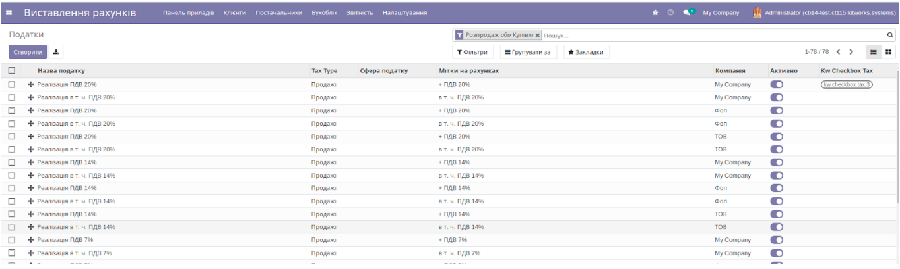

19.6. Перейти на вкладку Relations CheckBox Tax.

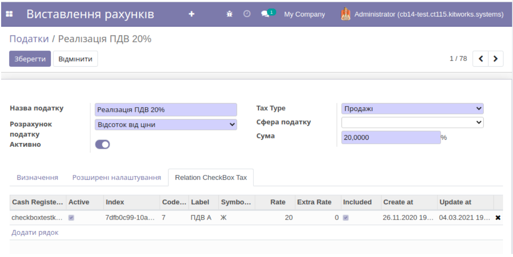

19.7. Додати в податок Odoo податок з Вашого аккаунту CheckBox.
Доданий податок CheckBox відобразиться в рядку податку Odoo в стовпчику “Kw Checkbox Tax”.

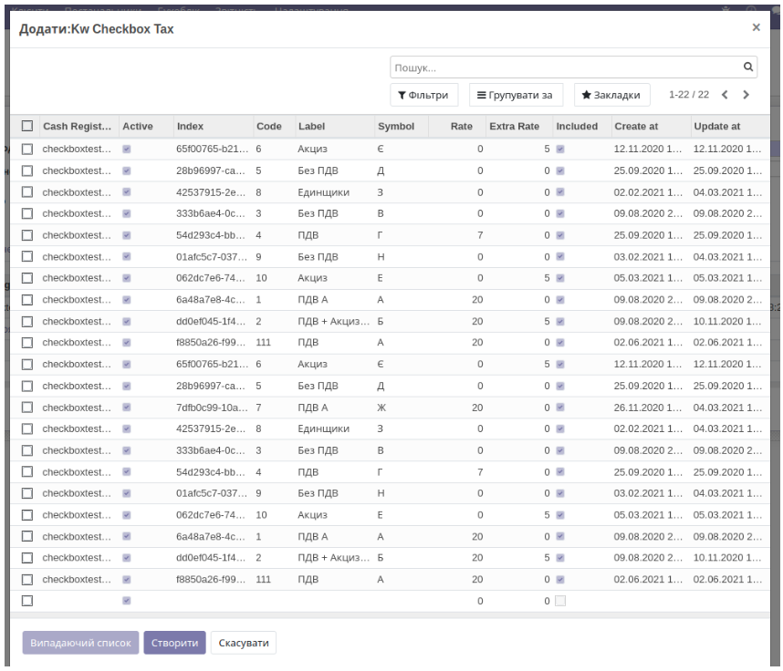
